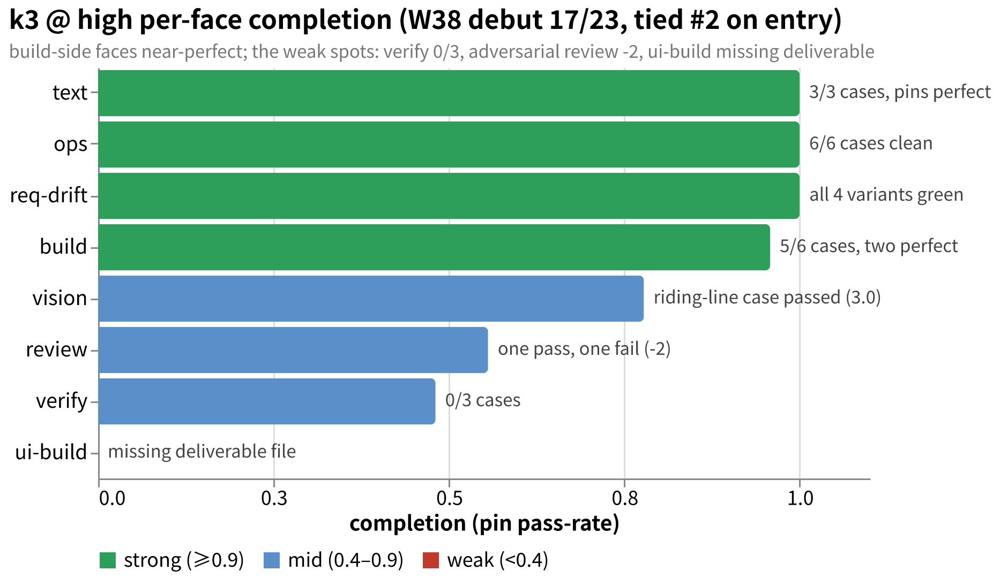
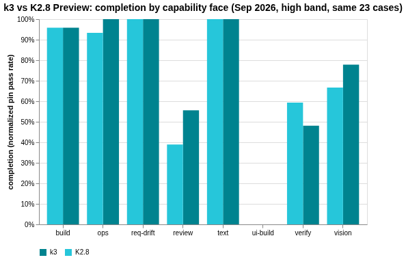
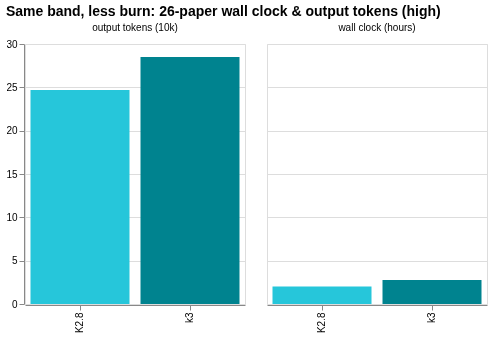

# amber-kimi

Public results from running Kimi (Moonshot AI)'s official coding endpoint (`api.kimi.com/coding`) models against the private **AMBER** benchmark. Results only — never the questions.
中文：[README.md](README.md)

## What this is

- One `results/YYYY-Www.md` per period: same paper, same harness, full library; models and effort bands of this endpoint side by side.
- Each issue reports: library size and hashes, per-case d2 score and pass/fail, terminal states, token usage and latency, environment fingerprint, and qualitative verdicts written under an evidence discipline.
- Questions, oracles, transcripts and intermediate artifacts are **never published** (see "Publication discipline" below).
- Sister repos: [amber-gpt](https://github.com/getaskclaw/amber-gpt), [amber-crof](https://github.com/getaskclaw/amber-crof), [amber-ollama](https://github.com/getaskclaw/amber-ollama), [amber-devin](https://github.com/getaskclaw/amber-devin), [amber-opencode](https://github.com/getaskclaw/amber-opencode), [amber-commandcode](https://github.com/getaskclaw/amber-commandcode), [amber-deepseek](https://github.com/getaskclaw/amber-deepseek), [amber-workbuddy](https://github.com/getaskclaw/amber-workbuddy). This repo's comparison axis is **models and effort bands of Kimi's official coding endpoint** — first entry is k3 @ high, full library; sibling models (`k3-256k`, `kimi-for-coding`, …) and other bands join later. Cross-repo citations always carry date and band.
- AMBER is an agentic, real-world-task benchmark (coding / ops / review / vision / requirement-drift). Spec and tooling: [getaskclaw/amber](https://github.com/getaskclaw/amber); the questions themselves stay private.

## W38 in one minute

Kimi official coding endpoint, high band, same 23 cases same hashes: **k3 17/23** (15/21 on the public 21-case subset) — coding 5/6 (full marks on the hard discriminator A-442d4aab 7/7 and A-569dbe0d 10/10) + ops 6/6 clean sweep + the riding-line vision case A-ea80d793 passed (3.0); weaknesses: verification 0/3 and an incomplete UI deliverable. Full matrix and lane ledger in the [2026-W38 issue](results/2026-W38.md). Chart sources live next to the PNGs (`docs/images/`, Vega-Lite).

### Extra race: k3 vs K2.8 Preview (Addendum 09-17)

On Sep 11 Moonshot silently re-pointed `kimi-for-coding` to **K2.8 Preview** (model ID unchanged). Same-library, same-band duel: **coding / text / requirement-drift faces match k3 paper-for-paper, at 27% less wall clock**; case-level 14/23, with all three gaps on known riding-line cases. But on the adversarial-review case it scored **-17 (k3: -2 — a hallucination flood)**: **K2.8 is fine for daily coding lanes, unusable for review lanes**. It actually beats k3 on the defensive-validation case (7/9 vs 4/9). Full table: the [2026-W38 issue](results/2026-W38.md), "Addendum 2026-09-17" at the end.

## Publication discipline (red lines)

1. We publish: scores and aggregates, token usage, speed, qualitative verdicts.
2. We never publish: question content, oracles/scorers, transcripts, candidate workspaces, or any intermediate artifact that could reconstruct a question.
3. Every issue pins: model ID, effort band, date (UTC), harness version, and a per-case content hash (bundle_sha). Hashes are checked against the public hash index in [amber](https://github.com/getaskclaw/amber) to prove the paper has not changed.
4. Case numbering and question structure are private: public results refer to cases only by stable aliases (A-xxxxxxxx, hash-derived) plus the bundle hash; internal case IDs, variant names, and question descriptions never appear.
5. Tone: this is community measurement, not an attack on any vendor. Let the data speak; keep the wording restrained.

## One methodological premise

Same model name, same provider, two runs can still score differently — sampling parameters, load, and server-side versions all drift. Every conclusion here carries a date and a band, and we re-run periodically. A single day's number is a snapshot, not a law.

## Results index

| Issue | Candidate | Score (23 cases / 21-case subset) | One-liner |
|---|---|---|---|
| [2026-W38](results/2026-W38.md) | **k3** (official coding endpoint flagship) | **17/23** (15/21) | Straight into the #2 tie; coding 5/6 + ops 6/6 + vision pass; verification 0/3, incomplete UI deliverable |
| ↳ [Addendum 09-17](results/2026-W38.md) | **K2.8 Preview** (`kimi-for-coding`) | **14/23** (12/21) | Matches k3 paper-for-paper on coding / text / req-drift at 27% less wall clock; adversarial review -17 (hallucination flood) — unusable there; defensive validation beats k3 (7/9 vs 4/9) |

## Disclaimer

No affiliation with or sponsorship by Moonshot AI / Kimi. Scores are snapshots of a specific week and band, not purchasing advice.
