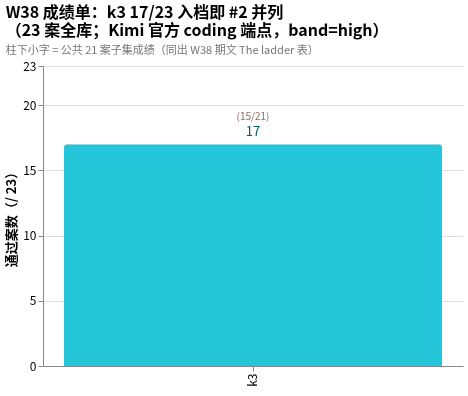

# amber-kimi

用私有题库 **AMBER** 实测 Kimi（Moonshot AI）官方 coding 端点（`api.kimi.com/coding`）的在目型号，只公开结果，不公开题目。
English: [README.en.md](README.en.md)

## 这是什么

- 每期一篇 `results/YYYY-Www.md`：同题、同 harness，对目标模型跑全库；同端点跨型号 / 跨档位并排。
- 一期固定报告：题集规模与哈希、每案 d2 分与通过 / 失败、终端终态、token 用量与时延、环境指纹、按证据纪律写的定性裁决。
- 题目、oracle、transcript、中间产物**永不公开**（见下「发布纪律」）。
- 姐妹仓：[amber-gpt](https://github.com/getaskclaw/amber-gpt)（GPT 系周测）、[amber-crof](https://github.com/getaskclaw/amber-crof)（CrofAI 周测）、[amber-ollama](https://github.com/getaskclaw/amber-ollama)（Ollama Cloud 周测）、[amber-devin](https://github.com/getaskclaw/amber-devin)（Devin 周测）、[amber-opencode](https://github.com/getaskclaw/amber-opencode)（OpenCode Go 道）、[amber-commandcode](https://github.com/getaskclaw/amber-commandcode)（CommandCode 道）、[amber-deepseek](https://github.com/getaskclaw/amber-deepseek)（DeepSeek 官方道）、[amber-workbuddy](https://github.com/getaskclaw/amber-workbuddy)（WorkBuddy ACP 道）。本仓的对照轴是 **Kimi 官方 coding 端点的型号与档位**——首发 k3 @ high 全库；同端点其他型号（`k3-256k`、`kimi-for-coding` 等）与其他档位后续入档并排。跨仓引用一律带日期与档位声明。
- AMBER 是 agentic 实战题库（编码 / 运维 / 审查 / 视觉 / 需求漂移），规范与制题工具见 [getaskclaw/amber](https://github.com/getaskclaw/amber)；考题本体私有。

## 一分钟看懂 W38

Kimi 官方 coding 端点、high 档、23 案同哈希：**k3 17/23**（公共 21 案子集 15/21）——编码面 5/6（硬区分器 A-442d4aab 7/7 满分、A-569dbe0d 10/10 满分）+ 运维面 6/6 全清 + 视觉骑线案 A-ea80d793 过线（3.0）；短板在核验面 0/3 与 UI 案交付缺文件。逐案矩阵与车道账本见 [2026-W38 期文](results/2026-W38.md)。图源与 PNG 同目录（`docs/images/`，Vega-Lite）。

## 发布纪律（红线）

1. 只发：分数与聚合、token 用量、速度、定性裁决。
2. 永不发：题目内容、oracle / 判分器、transcript、考生工作区、任何能复原题面的中间产物。
3. 每期必钉：模型 ID、effort 档、日期（UTC）、harness 版本、每案内容哈希（bundle_sha）。哈希用于对照 [amber](https://github.com/getaskclaw/amber) 的公开哈希清单，自证题集未变。
4. 案号与题目结构属私有面：公开结果里案例只用稳定别名（A-xxxxxxxx，哈希派生）+ bundle 哈希作句柄；内部案号、变体名、题目描述永不出现。
5. 基调：这是社区实测，不是对厂商的攻击。数据说话，措辞克制。

## 一个方法论前提

同名模型、同 provider，两次跑也可能不同分——推理参数、负载、服务端版本都在漂。所以这里的一切结论都带日期与档位，且定期重测。单日数字是快照，不是定律。

## 结果索引

| 期 | 考生 | 成绩（23 案 / 公共子集 21） | 一句话 |
|---|---|---|---|
| [2026-W38](results/2026-W38.md) | **k3**（官方 coding 端点旗舰） | **17/23**（15/21） | 入档即 #2 并列；编码 5/6 + 运维 6/6 + 视觉过线；核验 0/3、UI 交付缺文件 |

## 免责

与 Moonshot AI / Kimi 无任何隶属 / 赞助关系。分数是特定周、特定档位的快照，不构成采购建议。
